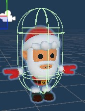
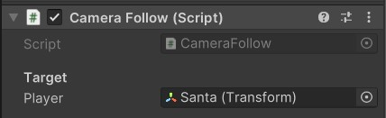
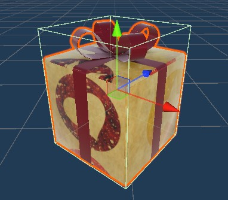
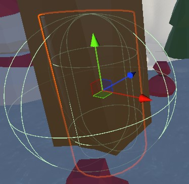
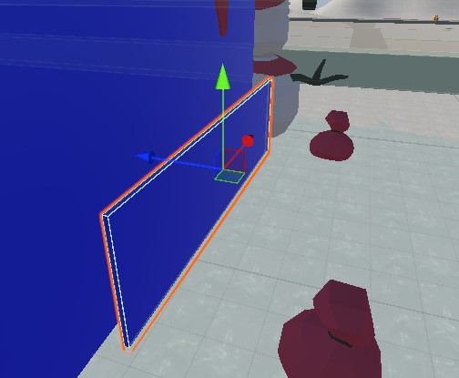
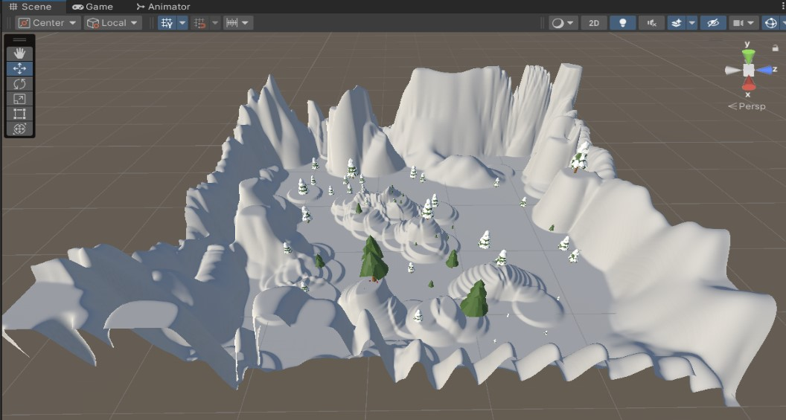
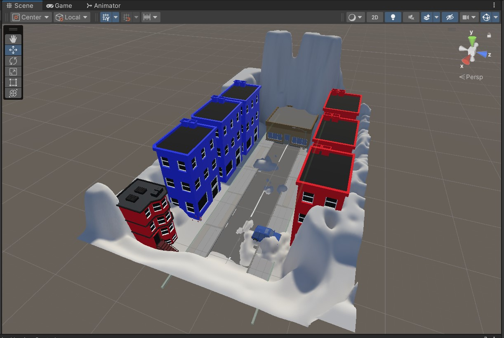
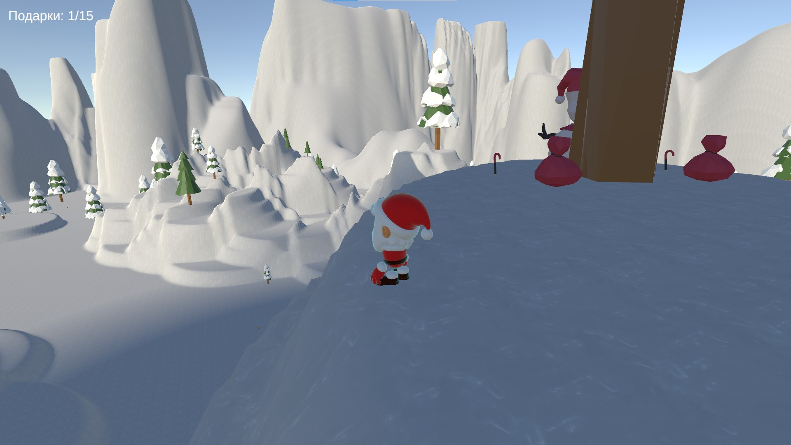
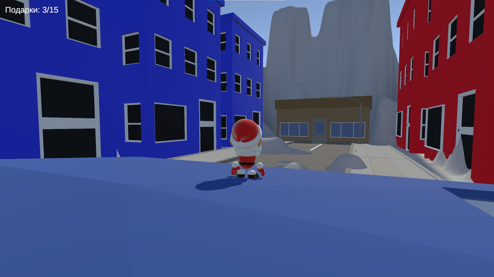
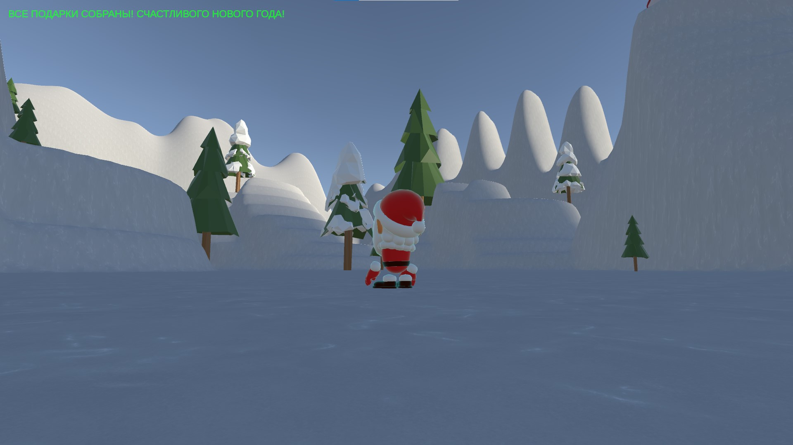

# 🎄 Игра-квест на Unity3D --- Сбор подарков и телепортация между уровнями

## 📌 Описание проекта

Этот проект --- 3D-игра, созданная в Unity3D.\
Игрок управляет персонажем, который путешествует между двумя сценами и
собирает подарки.\
Цель --- собрать все подарки на уровне, после чего появляется
поздравительное сообщение.
- ПРОЕКТ ВЫПОЛНЕН В РАМКАХ КУРСОВОЙ РАБОТЫ ПО ДИСЦИПЛИНЕ "ПРОГРАММИРОВАНИЕ МОБИЛЬНЫХ УСТРОЙСТВ" НА 4 КУРСЕ ИИВТ СИБГУТИ

Игровая механика включает: - движение, прыжки, бег и анимации
персонажа; - сбор подарков с вращающимися и плавающими объектами; -
переход между сценами через порталы; - автоматические границы уровня; -
систему UI прогресса; - музыку и звуковые эффекты.

------------------------------------------------------------------------

# 📁 Содержание

-   [Игрок](#игрок)
-   [Камера](#камера)
-   [Подарки](#подарки)
-   [Порталы](#порталы)
-   [Сцены](#сцены)
-   [Аудиосистема](#аудиосистема)
-   [Система подсчёта подарков](#система-подсчёта-подарков)
-   [Границы уровней](#границы-уровней)
-   [Структура скриптов](#структура-скриптов)
-   [Скриншоты](#скриншоты)

------------------------------------------------------------------------

## 🧑‍🎅 Игрок

Персонаж основан на модели *Santa prefab*.

**Компоненты:** - CharacterController --- управление перемещением -
Animator --- воспроизведение анимаций - PlayerController --- логика
ходьбы, бега и прыжков - PlayerStats --- подсчёт подарков и UI - Face
Animator --- анимация лица - AutoBoundary --- ограничение передвижения
по уровню

### Основные возможности PlayerController:

-   движение относительно камеры;
-   плавное вращение;
-   прыжок с физикой;
-   система гравитации;
-   интеграция с анимациями.

------------------------------------------------------------------------

## 🎥 Камера

Скрипт **CameraFollow** отвечает за: - плавное следование за игроком; -
вращение камеры мышью; - адаптацию высоты при взгляде вверх/вниз; -
автоматическую привязку к игроку; - ограничение вертикальных углов.

 

------------------------------------------------------------------------

## 🎁 Подарки

Подарки --- вращающиеся и плавающие объекты, имеющие уникальные ID.

**Функции RotatingPresent:** - вращение вокруг вертикальной оси; -
синусоидальное плавание; - обработка подбора; - предотвращение
повторного появления ранее собранного подарка; - проигрывание звука.

------------------------------------------------------------------------

## 🔮 Порталы

Порталы позволяют перемещаться между сценами.\
Система использует уникальные `portalID` и `targetPortalID`.

**Функции ScenePortal:** - обнаружение игрока; - сохранение ID целевого
портала; - загрузка другой сцены; - корректное позиционирование игрока
после телепортации.

------------------------------------------------------------------------

## 🌲 Сцены

### Forest

Природная зона, подарки и портал в город.

### City

Городская площадь с подарками и порталом обратно.

------------------------------------------------------------------------

## 🔊 Аудиосистема

**AudioManager** управляет: - музыкой (кроссфейд, плейлист,
перемешивание); - звуковыми эффектами; - предварительной загрузкой
аудио; - громкостью музыки и эффектов; - воспроизведением смеха Санты
при подборе подарка.

------------------------------------------------------------------------

## 🧩 Система подсчёта подарков

### PlayerStats:

-   создаёт UI программно;
-   отображает: `Подарки: X/Y`;
-   сохраняет прогресс между сценами;
-   показывает победное сообщение при сборе всех подарков.

### PresentManager:

-   хранит ID собранных подарков;
-   предотвращает повторное появление объектов;
-   реализован как синглтон.

------------------------------------------------------------------------

## 🗺️ Границы уровней

Класс **AutoBoundary**: - автоматически определяет размеры террейна; -
рассчитывает безопасные границы; - обновляет их при смене сцен; -
удерживает игрока в пределах карты.

------------------------------------------------------------------------

## 📦 Структура скриптов

  Скрипт             Описание
  ------------------ -----------------------------------
  PlayerController   Управление перемещением персонажа
  PlayerStats        Учёт подарков и UI
  CameraFollow       Камера третьего лица
  RotatingPresent    Логика подарков
  ScenePortal        Межсценовые переходы
  PlayerManager      Создание игрока и телепортация
  PresentManager     Глобальный учёт подарков
  AudioManager       Музыка и звуки
  AutoBoundary       Границы уровня

------------------------------------------------------------------------

## 🖼️ Скриншоты

------------------------------------------------------------------------

# 🎉 Заключение

Проект демонстрирует работу: - с 3D сценами и переходами; -
CharacterController; - триггерами и объектами сцены; - аудио, UI,
анимациями и физикой.

